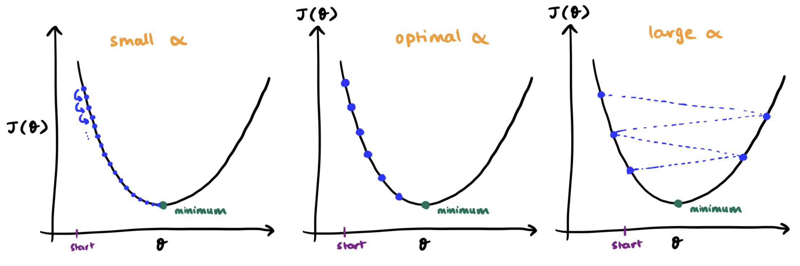

# CS677 Machine Learning Midterm Project

In this midterm project, I had to respond to 5 questions of my choosing in detail, and draw pictures when possible.

- [Underfitting and Overfitting](#underfitting-and-overfitting)
- [Cross-Validation](#cross-validation)
- [Gradient Descent](#gradient-descent)
- [Empirical Risk Minimization](#empirical-risk-minimization)
- [Non-Uniform Learnability](#non-uniform-learnability)

## Underfitting and Overfitting
**What is bias, variance, underfitting, and overfitting? Explain with images.**

When evaluating the performance of a learning predictor, it is important to consider the model's generalization errors, and their effects. There are three main generalization errors for models, namely bias, variance, and irreducible error.

Error due to bias is caused due to incorrect underlying assumptions about the data. A very simple example is a model that assumes linear data, whereas the data may actually be quadratic or polynomial. Another simple but real-world example is a dataset containing data about males and females, but there is more data about males than females. If this bias is not captured in the model, the model will have an underlying bias for prioritizing male data over female data, causing high errors in the training data. This would have a high bias value, meaning that this model does not accurately capture reality.

Error due to variance is caused due to sensitivity to variations in the data. As an example, if there are two similar training sets A and B with slight variations, the model will output a set of predictions, $\hat{y}_A$ and $\hat{y}_B$ for the test data, which will be compared to the true data, $y_A$ and $y_B$ respectively. If $\hat{y}_A$ and $\hat{y}_B$ are very different to each other, then it means the model is very sensitive to small changes and does not generalize well. This difference between the error rates of training ($y$) data and the test ($\hat{y}$) data is called variance.

If a model has high bias, it will underfit the data, meaning that it is unable to capture underlying patterns in the data, and so the model will not fit the data points very well. Common examples of when underfitting occurs are when there isn't sufficient training data for the model to learn the patterns, or when a very simple mathematical model (e.g. linear) is used to model complex patterns (e.g. polynomial).

If a model has high variance, it will overfit the data, meaning that it has learned the specific patterns of the data and/or any noise in the data, and fits to the data points too closely. Common examples of when overfitting occurs are when the data has a lot of noise, or when there isn't enough training data.

I drew a picture to demonstrate the difference in underfitting and overfitting, caused due to high bias and high variance respectively.

(caption) My drawing to demonstrate bias, variance, underfitting and overfitting. The top-left graph shows some data points. The top-right graph shows a well-fitted model, that captures reasonable assumptions about the data and is able to generalize the model fit to the data. The bottom-left graph shows an underfitted model due to high bias in the model assuming a linear distribution, when it should have assumed a polynomial distribution, and therefore having a very general model. The bottom-right graph shows an overfitted model due to high variance in the model due to high sensitivity, and therefore having a very specific model.

[back to top](#cs677-machine-learning-midterm-project)

## Cross-Validation
**Explain cross validation and k-fold cross validation with pictures.**

In order to estimate the true error of a predictor, one method used is to hold out a subset of the data called the validation set, which is different to the training set. The empirical error is then used on this validation set to estimate the predictor's error. One such hold-out method is cross-validation.

Cross validation is a technique for evaluating the errors of models by evaluating them on different hold-out subsets of the data. The data is first split into only training and test splits (no validation split). The parameters of the model are then iterated over through the cross-validation test to find the most optimal values of the parameters. These optimal parameters are then implemented in the model, which is re-trained. Finally, the performance of this model with optimal parameters is evaluated on the accuracy and generalizability. 

There are different types of cross-validation techniques, for example hold-out, k-folds, leave-one-out, and leave-p-out. Since the question requires me to describe k-fold cross-validation, I will describe that here. In k-fold cross-validation, all the data is used as dual-purpose: training and testing. This happens by splitting the data into k subsets, also called folds. In an iterative process for each fold, all the other folds are treated as training data on which the model is trained, and then that fold is used as the testing data to evaluate the model's performance for that iteration. The model performance for each fold is then evaluated to find the most optimal parameters.

Cross-validation is a widely-used technique to evaluate the performance of different machine learning algorithms on the data. It is very useful for detecting overfitting since the model infers lack of generalization during each iteration. However, in the literature, cross-validation techniques are still an open problem in research, because the results of cross-validation and its behavior is not well-understood yet. For k-fold cross-validation, unbalanced data will not provide good results, and neither will unstable algorithms.

I drew a picture to demonstrate how k-fold cross-validation works.

(caption) My drawing to demonstrate k-fold cross-validation. Take, for example, a dataset with 40 data points, which is split such that there are 30 training data points, and 10 testing data points. Letting k=3, we take the training set and split it into 3 subsets (called folds), each with 10 data points now. We then iterate over each fold and split the 10 data points in each fold proportionately as per the original data set (in this case, the proportion is roughly 80/20), but rotating the training and testing-designated data points for each fold iteration, such that each of the data points get to be a training point and a testing point at some point in the iteration. For each fold iteration, we evaluate the performance of the fold. After all 3 iterations, we find the optimal parameters and finally evaluate the model's performance with these optimal parameters on the original test data.

[back to top](#cs677-machine-learning-midterm-project)

## Gradient Descent
**Explain with pictures the impact of learning rate alpha in Gradient Descent.**

Gradient descent is an optimization algorithm which finds optimal solutions to problems. The algorithms works by tweaking parameters iteratively to minimize the cost function. It measures the local gradient of the cost function with respect to the set of parameters $\Theta$ and continues in the direction of descending gradient to reach the minimum gradient of 0, which is when the cost function has been minimized.

Specifically, first, the parameters for the gradient descent algorithm are initialized with randomly-selected values. These parameters are then tweaked step-wise to minimize the cost function until a minimum is reached, at which point the model has been optimized. The size of the step matters, and is determined by the learning parameter $\alpha$:

$$
\begin{equation}
    \theta_1 = \theta_1 - \alpha \frac{d}{d \theta_1} J(\theta_1)
\end{equation}
$$

Here, $\alpha$ is a hyperparameter which is tuned to determine the appropriate step size to converge the cost function to a minimum. If $\alpha$ is too small, then the algorithm will take many iterations to converge, which is costly in terms of time. However, this means that it would reach a high degree of precision, i.e. the algorithm will find the most precisely optimal parameter values for the model such that its cost function is minimized.

If $\alpha$ is too large, then the step will take large steps for each iteration, which may take fewer steps to converge depending on the shape of the function. However if the shape of the function is too steep, then each large step may not reach the minimum value of the cost function and may diverge from the minimum and not reach a solution.

However, an optimal $\alpha$ will take appropriate steps for each iteration and converge to a minimum without costing too much time or causing any divergence.

I drew a picture to demonstrate the impact of the size of learning rate $\alpha$ in gradient descent optimization algorithms.

(caption) My drawing to demonstrate the impact of choosing small, optimal, and large values for the learning rate $\alpha$ in gradient descent optimization algorithms.

[back to top](#cs677-machine-learning-midterm-project)

## Empirical Risk Minimization
**What is Empirical Risk Minimization? Explain Inductive Bias.**

A predictor is developed by the machine learning algorithm during the training phase, and is a function that takes as input a set of parameters, $\Theta$, and outputs a predicted label, $\hat{y}$ for a data point. Predictors are used during the machine learning process to learn from the training set of data, develop rules and inferences for labeling an unseen data point, and testing the performance of the predictor on unseen test data points, i.e. the predictor makes a prediction, $\hat{y}$, which is then compared against the true label, $y$, using a loss function $\mathscr{L}(\Theta)$. The loss function quantifies how approximate the predicted label $\hat{y}$ is to the true label $y$.

The machine learning process receives as input a training sample of data, $S$, which is sampled from an unknown distribution $D$. Given that $D$ is unknown, the true loss cannot be known either. Therefore, in order to approximate a loss, the empirical loss, $L_S$ is calculated as the average loss over the training data points. However, it does not provide an accurate representation of the true loss. The true loss, $L_D$ is determined using the empirical loss predictor, except that the true loss is calculated using the test dataset, and averaged over the test data points. 

In order to have a good predictor, we need to minimize the empirical loss with respect to the training set of data $S$ and with respect to the distribution $D$. This is known as Empirical Risk Minimization (ERM), and is used by the predictor to learn from the data. ERM chooses the most optimal $\Theta$ such that it minimizes the loss $\mathscr{L}(\Theta)$.

Before the learner ingests the training data, it needs to choose a set of predictors, called a hypothesis class. In other words, before the learner ever sees the data, it chooses one hypothesis over others, meaning that whatever hypothesis the learner chooses, it will be biased toward that hypothesis over the others. This is known as inductive bias. Inductive bias can be useful because if a hypothesis is chosen such that it aligns with the characteristics of the data (e.g. choosing a polynomial model when the data is also polynomial), then it will predict better predictions on unseen data.

[back to top](#cs677-machine-learning-midterm-project)

## Non-Uniform Learnability
**What is Convex Function and Non-Uniform Learnability?**

A convex function is a mathematical function which states that for any points $x_1$ and $x_2$, the line segment joining $f(x_1)$ and $f(x_2)$ lies above the graph for the two points. It has the property that a local minimum is also a global minimum, and vice versa. 

(caption) My drawing to demonstrate an example of a convex function. Note that the graph area (shaded in blue) falls below the line segment connecting $f(x_1)$ and $f(x_2)$, hence it is convex.

This leads to the idea of convex learning, which utilizes convex optimization techniques for solving machine learning programs. In other words, it has a convex set as its hypothesis class, and a convex loss function. optimization of convex models is used when we want to ensure that the solutions are global minima, due to the properties of convex functions.  Convex learning algorithms are used in regression, classification, clustering, feature selection and more for both supervised and unsupervised algorithms.

Non-uniform learnability is able to deal with non-uniform data samples. The minimum number of samples required for non-uniform learning is dependent on the best hypothesis $H$. However if the estimation error of the learner predictor is small, it may still have a large risk, depending on whether $H$ has a large approximation error. This is seen when applied to polynomial regression, for example, since the learner adapts to the best fit (curved instead of straight line) due to non-uniform learnability. Non-uniform learning enables many concepts classes to be learned which may not be able to be learned by other learning types to to the non-uniformity of the data samples.

(caption) My drawing to demonstrate non-uniform polynomial regression. The fit to the same set of data points gets better as the degree of polynomial increases. This shows non-uniform learnability for polynomial regression.

[back to top](#cs677-machine-learning-midterm-project)